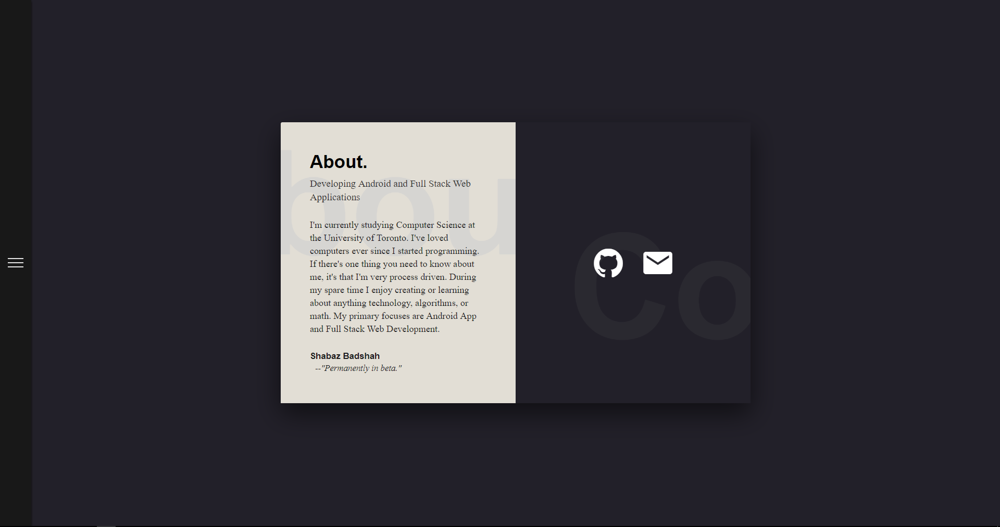
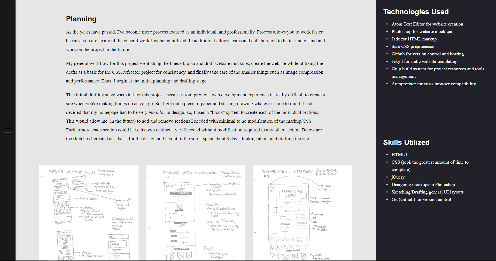

The source of truth for all of my personal websites is my Github repository. You can find the source code for all of my personal sites <u>[**here**](https://github.com/ShabazBadshah/shabazbadshah.com)</u>.

Each version of my personal site has been a learning experience, and I have documented each one in detail.

**You can find each version (v1-v5) in their own branches. Their READMES break down the tech stack and the reasoning/features behind each upgrade**

Below is a visual gallery of all the iterations of my personal sites, along with links to their respective articles.

# Site 1.0

# Site 2.0

# Site 3.0

# Site 4.0

