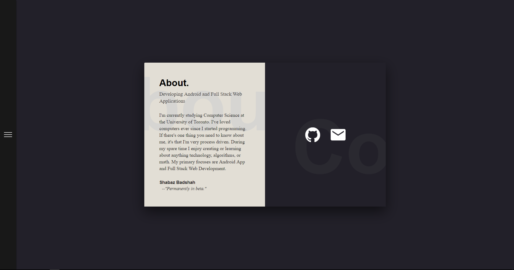
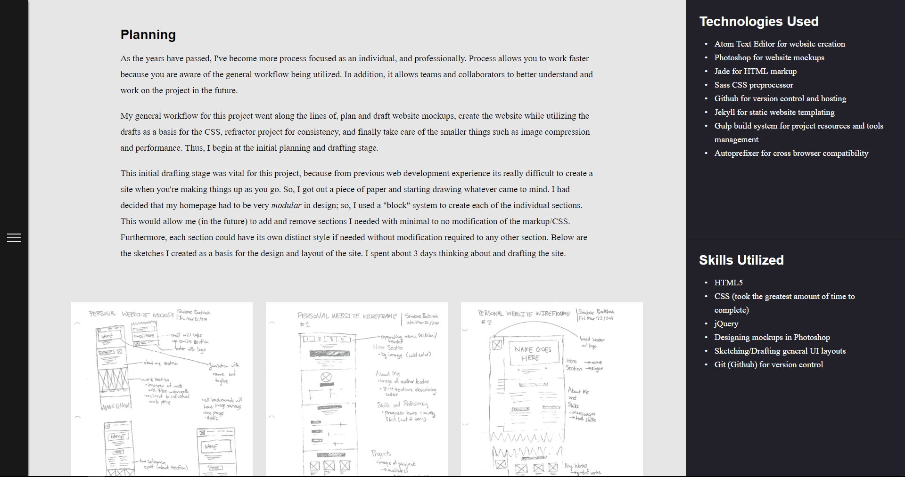

## Project Synopsis

_This second iteration of my site was primarily a redesign of my personal brand to tell a more consistent and streamlined story of myself and my works._

## Tools, Technologies, and Skills

- VS Code text editor
- Github for version control and hosting
- Jekyll for static website templating
- Gulp build system for project resources and tools management
- jQuery

## Planning

There was minimal planning for this project, it didn't require any. I finished the site in about 2 days which included redoing the CSS, throwing some javascript in the site for some dynamic content, and moving all my old works from my previous site to this new one. Below are the only two mockups I created for my site.

## Challenges, Issues, and their Resolutions

There were no significant "challenges" during this project that impeded my progress.

## Links

- [Source Code](https://github.com/ShabazBadshah/PersonalWebsiteV2)
